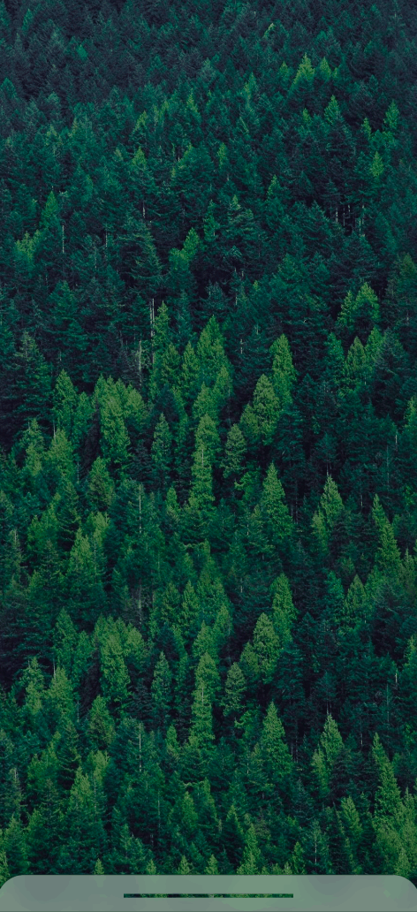
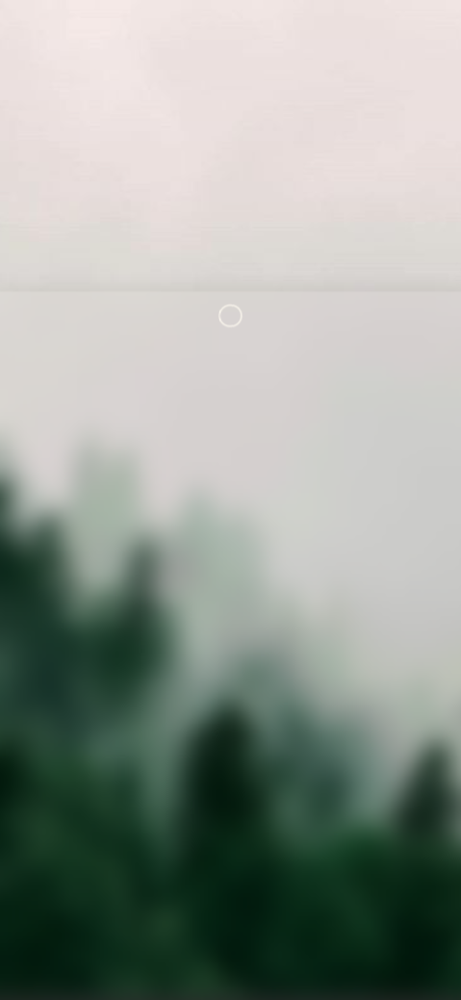
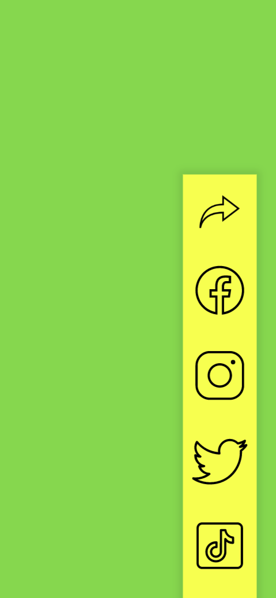
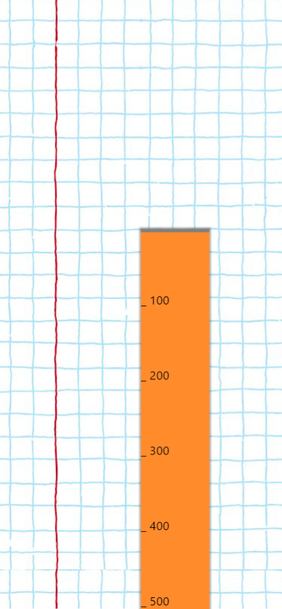

# Awesome, awesome bottom sheet

Swipeable bottom sheet for web apps, built with [React.js](https://reactjs.org/), [react-spring](https://www.react-spring.io/) and [react-use-gesture](https://use-gesture.netlify.app/docs/state/)

Check it out [here](http://axmz.github.io/react-bottom-sheet-awesome)  

    
    
    
    

# BTW, you can use bottom sheet as a ruler

